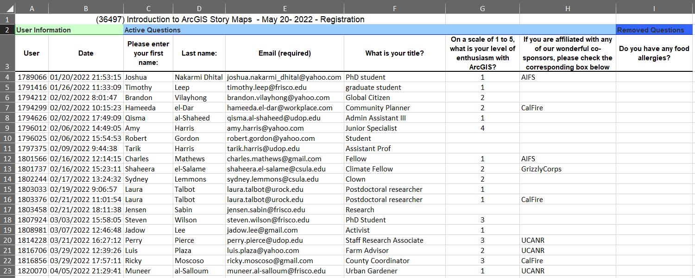
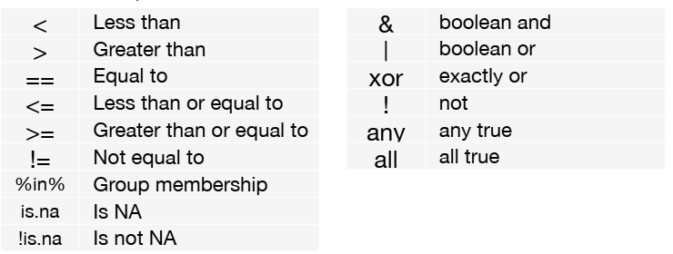

```{css echo = FALSE}
h1,h2,h3 {font-weight:bold;}
h1 {font-size:24px;}
h2 {font-size:20px;}
h3 {font-size:16px;}
```
\

# Importing Messy Excel Data

Although your data may be in a spreadsheet or CSV file, it may not be in an ideal format. See this registration list:



\

Here we see a bunch of stuff before the data, the column "names" are unwieldy, there are several extra columns we don't need, missing values, etc.

You can tackle many of these issues when you import the data. First, we construct the file name and verify it exists:

```{r chunk01}
reg_list_fn <- "./data/SurveyResults_36100.xlsx"
file.exists(reg_list_fn)
```

\

To import Excel files, we'll go to `read_xlsx()` from the *readxl* package. This function has a lot of options, so it's worth reading the help page:

```{r chunk02}
library(readxl)
reg_list_tbl <- read_xlsx(path = reg_list_fn, 
                         sheet = "Survey Output", 
                         skip = 3, 
                         col_names = c("user", "reg_date", "fname", "lname", 
                                       "email", "title", "org", 
                                       "cosponsor", "allergies"),
                         col_types = c("text", "text", "text", "text", "text", "text",
                                       "numeric", "text", "text"))

reg_list_tbl
```

\

Likewise, the [readr](https://readr.tidyverse.org/) package provides super-charged functions for importing and exporting rectangular data in text formats.

\

**Take Home Messages**

- Data wrangling starts when you import

- You're not limited to just using `read.csv()`

\

# `dplyr` methods

Load dplyr:

```{r chunk03}
library(dplyr)

```


\

We can proactively prevent function name clashes with the `conflicted` package:

```{r chunk04}
## Load the conflicted package
library(conflicted)

# Set conflict preferences
conflict_prefer("filter", "dplyr", quiet = TRUE)
conflict_prefer("count", "dplyr", quiet = TRUE)
conflict_prefer("select", "dplyr", quiet = TRUE)
conflict_prefer("arrange", "dplyr", quiet = TRUE)
```

\

We begin by looking at the Palmer Penguins data:

```{r chunk05}
library(palmerpenguins)
head(penguins)
```

\

dplyr provides `glimpse()` which is an alternative way preview a tibble:

```{r chunk06}
glimpse(penguins)
```


\

# Maniuplating Columns

## Subset Columns

Suppose we want to compare how bill length and flipper length look for each species. We could start by selecting just those columns:

```{r chunk07}
penguins |> 
  select(species, bill_length_mm, flipper_length_mm) |> 
  head()
```

\

You can also **rename** columns with `select()` (dplyr also has a `rename()` function):

```{r chunk08}
penguins |> 
  select(species, bill = bill_length_mm, flipper = flipper_length_mm) |> 
  head()
```

\

If you want to extract the values from a single column and get the results back as a vector, 
use `pull()` (similar to the `$` operator):

```{r chunk09}
penguins |> pull(species) |> table()
```

\

## Add/Modify Columns

To **add a column**, we can use `mutate()`. Let's create a new column with the ratio of the bill to flipper length:

```{r chunk10}
peng_billflip_tbl <- penguins |> 
  select(species, bill_length_mm, flipper_length_mm) |>
  mutate(bill_flip_ratio = bill_length_mm / flipper_length_mm)
  
head(peng_billflip_tbl)
```

\

`mutate()` can also be used to modify existing columns, for example we could round bill_flip_ratio to 3 decimal places.

```{r chunk11}
peng_billflip_tbl <- peng_billflip_tbl |> 
  mutate(bill_flip_ratio = round(bill_flip_ratio, 3))

head(peng_billflip_tbl)
```

\


# CHALLENGE #1

Add a column called `bill_flip_sum` which represents the sum of the bill and flipper length.

Hint: use `mutate()`

```{r chunk12}
penguins |> 
  mutate(bill_flip_sum = bill_length_mm + flipper_length_mm) |> 
  head()
```

\

# Maniuplating Rows

## Sort Rows

You can **sort** a table using `arrange()`, passing the column(s) you want to sort by. The default sort order is ascending, but you can change that to descending by wrapping the column name in `desc()`.

Sort by flipper size (smallest to largest):

```{r chunk13}
peng_billflip_tbl |> 
  arrange(flipper_length_mm) |> 
  head()
```

\

Largest to smallest:

```{r chunk14}
peng_billflip_tbl |> 
  arrange(desc(flipper_length_mm)) |> 
  head()
```

\

## Subset Rows

The two functions most commonly used to subset rows include `filter()` and `slice()`.

  - use `slice()` to subset based on indices

  - use `filter()` to subset based on a logical expressions

\

Logical expressions you can use in `filter()` include:



\

Suppose we only wanted to work with observations of *Gentoo* penguins:

```{r chunk15}
gentoo_billflip_tbl <- peng_billflip_tbl |> 
  filter(species == "Gentoo") 

glimpse(gentoo_billflip_tbl)
```

\

If you want to filter on two criteria, add a second expression to `filter()`:

```{r chunk16}
peng_billflip_tbl |> 
  filter(species == "Gentoo", flipper_length_mm > 220) |> 
  select(species, flipper_length_mm) |> 
  glimpse()
```

\

Suppose we wanted to identify the top 5 Gentoo observations with the largest bill_flip_ratio value. We can do that using a combination of `arrange()` and `slice()`:

```{r chunk17}
gentoo_billflip_tbl |> 
  arrange(desc(bill_flip_ratio)) |> 
  slice(1:5) 
```

\

We could also use `top_n()`:

```{r chunk18}
gentoo_billflip_tbl |> 
  top_n(5, bill_flip_ratio) |> 
  arrange(desc(bill_flip_ratio))
```

\

# CHALLENGE #2

Write an expression that pulls out just the males on Torgersen Island. HOw many are there?

Tip: For challenge questions 2 & 3, mix and match the following functions:

`select()`, `mutate()`, `pull()`, `arrange()`, `filter()`, `slice()`

```{r chunk19}
x = penguins |> 
  filter(island == "Torgersen", sex == "male") |> 
  head()

x
nrow(x)
```


\

# CHALLENGE #3

Compute the ratio of body mass to bill length and add it as a new column. Return just the species, sex, and this ratio.

```{r chunk20}
penguins |> 
  mutate(bm_bill_len_ratio = body_mass_g / bill_length_mm) |> 
  select(species, sex, bm_bill_len_ratio) |> 
  head()
```

\

# End

That's it! Remember to save your work to render a copy of your Notebook in HTML


